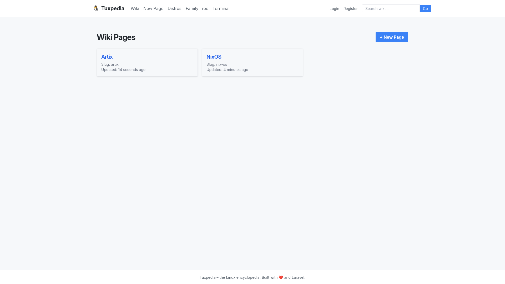
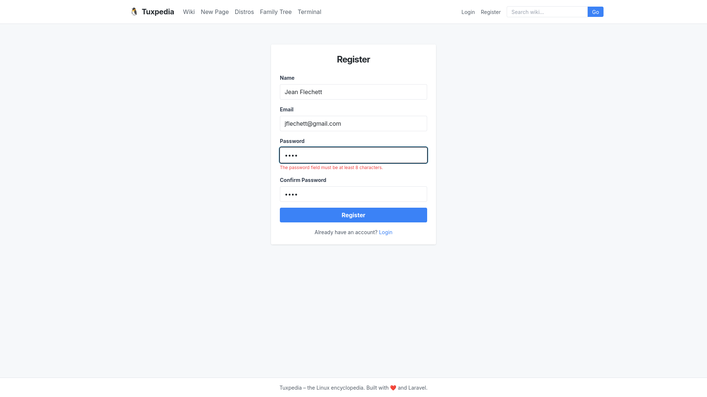
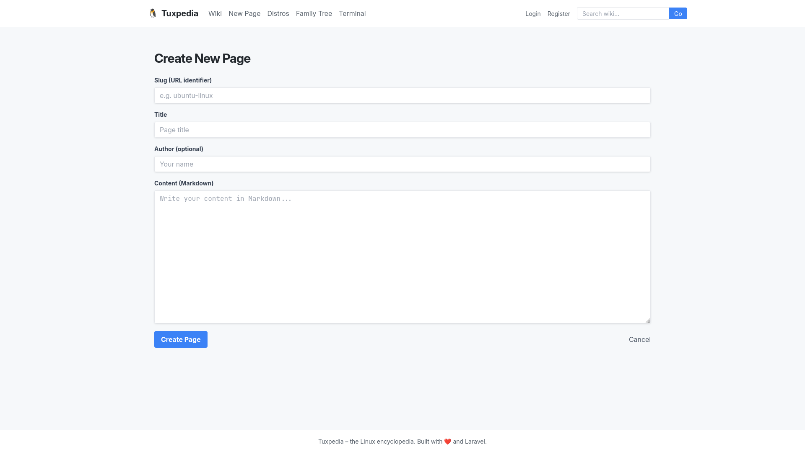
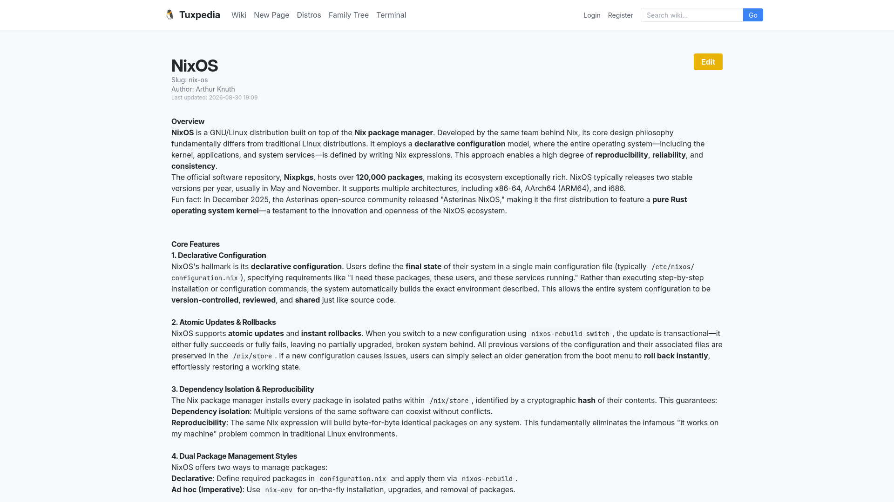
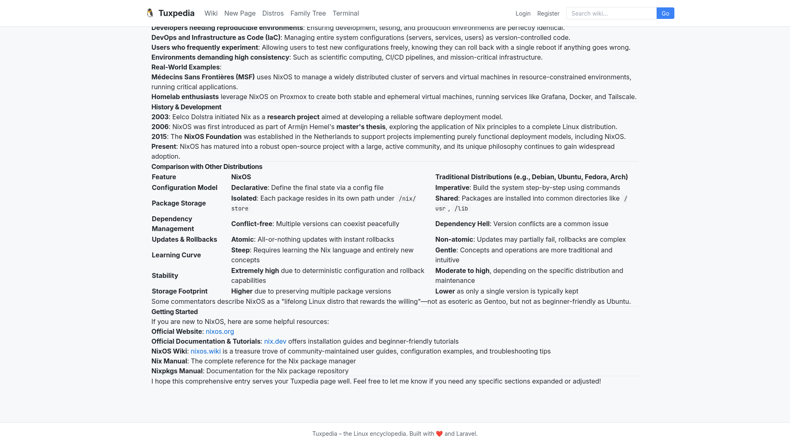
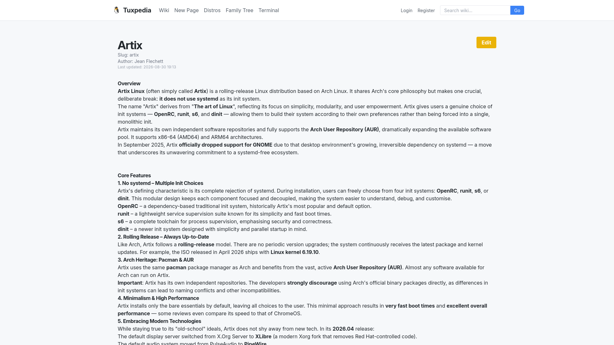
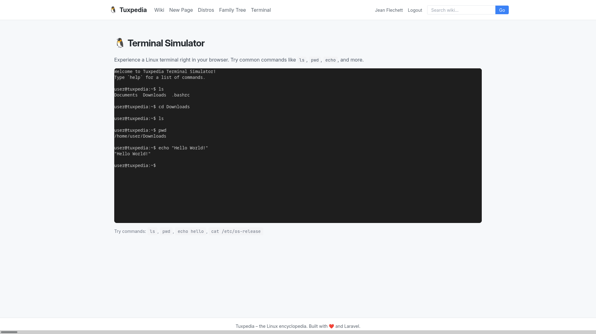

# 🐧 Tuxpedia

[](https://opensource.org/licenses/MIT)
[](https://php.net)
[](https://laravel.com)
[](http://makeapullrequest.com)

**The Linux Encyclopedia – with a live terminal simulator.**

---

## 💡 About

Since I first used Linux, I loved it. I love reading encyclopedias too. I wished there was a single place where I could look up distributions, compare their package managers, and actually try out commands – all without leaving the browser. Tuxpedia is the result of this.

It's a full‑stack web application that combines wiki‑style content management, distribution comparison, interactive family trees, and a fully functional terminal simulator. Whether you're a beginner exploring Linux or a seasoned admin looking for a quick reference, Tuxpedia gives you a clean, modern interface to learn and experiment.

---

## 📸 Screenshots

Main page screen:


Register page screen:


Create page screen:


Article example screen:


Article example screen 2:


Article example screen 3:


Terminal simulator screen:


---

## ✨ Features

- 📝 **Wiki** – Full CRUD with Markdown editing and Git versioning (every change is committed to a local Git repo)
- 📊 **Distro Comparison** – Sortable, filterable, searchable table of Linux distributions (seeded with real data)
- 🔍 **Full‑text Search** – MySQL FULLTEXT search with relevance ranking for wiki pages
- 🌳 **Family Tree** – Interactive D3.js tree visualization showing distribution lineages
- 🔐 **User Authentication** – Login, Register, Logout with Livewire and custom User model
- 🆕 **"Changed Since Last Visit"** – Green badge on pages updated after your last visit
- 🖥️ **Terminal Simulator** – Fully functional Linux terminal in the browser (xterm.js + virtual filesystem)

---

## 📋 Requirements

- PHP 8.4+
- Composer
- MySQL or MariaDB (or SQLite for development)
- Node.js & NPM (for asset compilation)

---

## 📦 Installation

```bash
# Clone the repository
git clone https://github.com/[username]/tuxpedia.git
cd tuxpedia

# Install PHP dependencies
composer install

# Install Node dependencies
npm install

# Compile CSS with Tailwind CLI
npm run css:build

# Copy environment file and generate key
cp .env.example .env
php artisan key:generate

# Configure your database in .env, then run migrations
php artisan migrate

# Seed distributions table
php artisan db:seed --class=App\\Features\\DistroComparison\\Database\\Seeders\\DistributionSeeder

# Start the development server
php artisan serve
```

---

## 🚀 Usage

Visit `http://localhost:8000` in your browser.

- **Wiki** – Browse pages, create new ones with Markdown, and see the "New" badge on recent updates.
- **Distro Comparison** – Search, filter, and sort distributions by various attributes.
- **Family Tree** – Explore the interactive lineage graph.
- **Terminal** – Type Linux commands like `ls`, `pwd`, `echo`, `cat /etc/os-release`, and more.

**Test credentials:**
- Email: `test@example.com`
- Password: `password123`

---

## ⚙️ Configuration

Environment variables are managed via `.env`. Key ones:

| Variable | Purpose |
|----------|---------|
| `DB_CONNECTION` | Database driver (`mysql`, `sqlite`) |
| `DB_DATABASE` | Database name |
| `APP_DEBUG` | Enable/disable debug mode |

---

## 📁 Project Structure

```
app/Features/          # Business capabilities (vertical slices)
├── Auth/              # User authentication (Login, Register, Logout)
├── DistroComparison/  # Sortable/filterable distribution table
├── FamilyTree/        # D3.js interactive lineage tree
├── Search/            # Full‑text search with relevance ranking
├── Terminal/          # Browser‑based terminal simulator
└── Wiki/              # Wiki CRUD with Markdown and Git versioning

app/Shared/            # Read‑only infrastructure (Database, Logging, Utils)
resources/views/features/  # Blade views per feature
public/js/terminal-simulator.js  # Virtual filesystem and command parser
```

**The Golden Rule:** Each feature folder can be deleted without breaking the rest of the application – no circular dependencies.

---

## 🛠️ Built With

- **Backend:** [Laravel 13](https://laravel.com) (PHP 8.4)
- **Frontend:** [Livewire](https://livewire.laravel.com) + [Alpine.js](https://alpinejs.dev) with Blade templates
- **CSS:** [Tailwind CSS](https://tailwindcss.com) (light theme, dark terminal)
- **Terminal:** [xterm.js](https://xtermjs.org) + custom virtual filesystem
- **Visualization:** [D3.js](https://d3js.org)
- **Version Control:** Git for wiki page history
- **Database:** MySQL with FULLTEXT indexes

---

## 🧪 Testing

```bash
# Run all tests (unit + integration)
php artisan test

# Run unit tests only
php artisan test --testsuite=Unit

# Run integration tests only
php artisan test --testsuite=Integration
```

---

## 🤝 Contributing

Contributions are welcome! Please follow these steps:

1. Fork the repository.
2. Create a feature branch (`git checkout -b feature/amazing`).
3. Commit your changes (`git commit -m 'Add amazing feature'`).
4. Push to the branch (`git push origin feature/amazing`).
5. Open a Pull Request.

Read the [CONTRIBUTING.md](CONTRIBUTING.md) for detailed guidelines.

---

## 📄 License

This project is licensed under the [MIT License](LICENSE) – see the [LICENSE](LICENSE) file for details.

---

## 🙏 Acknowledgements

- [Laravel](https://laravel.com) – the framework that makes PHP development a joy.
- [Livewire](https://livewire.laravel.com) – for building dynamic interfaces without writing JavaScript.
- [xterm.js](https://xtermjs.org) – for the authentic terminal experience.
- [D3.js](https://d3js.org) – for the interactive tree visualizations.
- The open‑source community for their incredible tools and inspiration.

---

## 💬 Questions / Support

Open an [issue](https://github.com/[username]/tuxpedia/issues) or reach out via [[email/chat]].

---

## 📜 Changelog

See the [CHANGELOG.md](CHANGELOG.md) file for version history.
